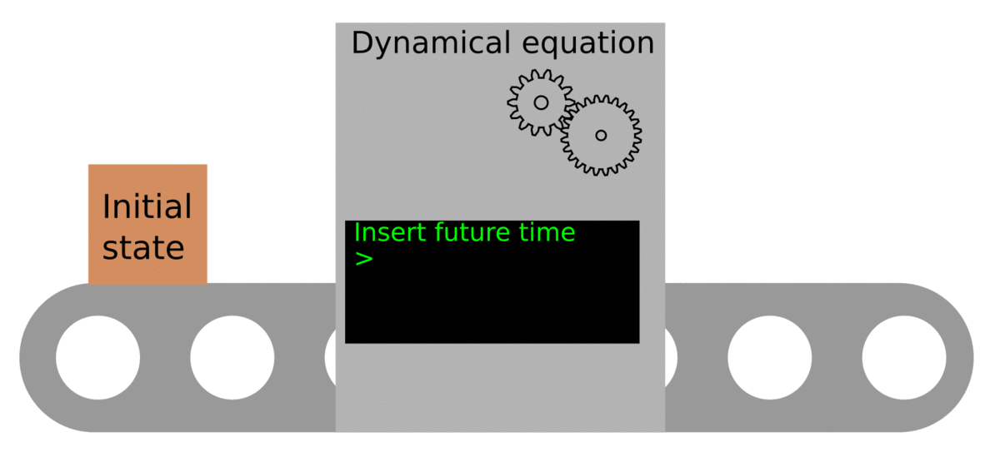

# What are differential equations, and why are them useful?

In year 2012 the mathematician Ian Stewart published is book _17 equations that changed the world_.
From this selection of 17 influential equations, 9 of them are deeply related to differential equations, and 7 of them are differential equation themselves.

But what is a differential equation?
Differential equations are the fortune-tellers of science.
You give them information about the present state of a system, and they calculate for you all its future states.

Differential equations are the easiest and most common approach to modelling, and the natural language of fields such as population dynamics, chemical kinetics or classical mechanics.

In this course we are going to deal with the most common application of differential equations, the so-called initial value problems.
These problems always have the same basic components:

> ## Anatomy of an initial value problem
> - The current state, also known as initial condition
> - A rule that given the current state calculates the future states, also known as dynamical equation
> - The future time we want to know about
{: .checklist}

In the animation below we can see a useful analogy. Here, the dynamical equation is represented as a machine that transforms the initial state of a system into a future state. Which future state? The one we choose.

> ## Anatomy of an initial value problem
> Stop for a moment and identify the three elements given in the box "Anatomy of an initial value problem" in the animation above.
{: .challenge}


